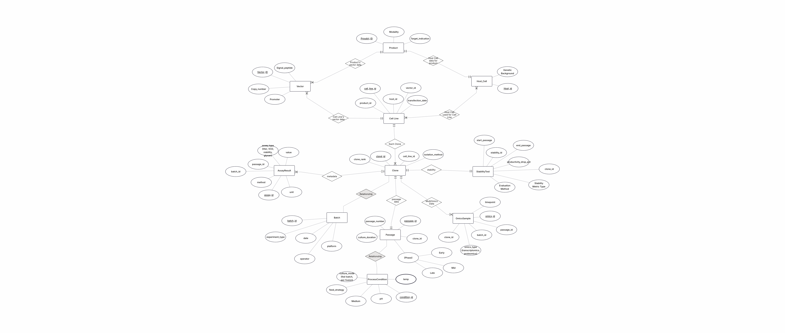

# CLD-ML-Pipeline

## Overview
This repository demonstrates a machine-learning-ready data architecture
for Cell Line Development (CLD) using synthetic data.

## Current Status
🚧 Under active development.

Currently included:
- ML-optimized ERD for CLD 
- SQLite database schema
- Synthetic CLD data generation

## Planned Features
- Feature engineering for clone-level ML
- Early productivity drop clone screening
- Stability prediction models (stable or not stable) which apply for fet-batch or perfusion process

## License
Apache License 2.0
